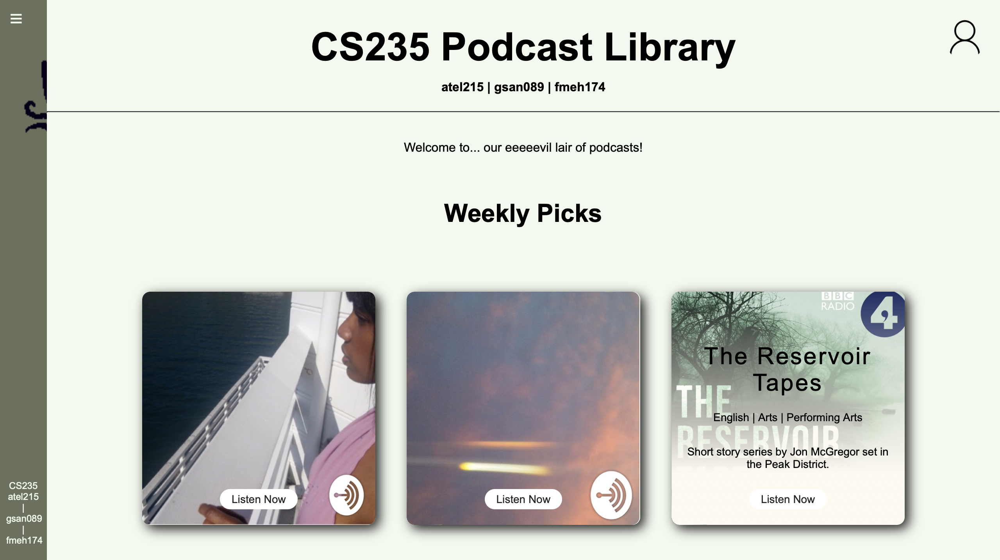
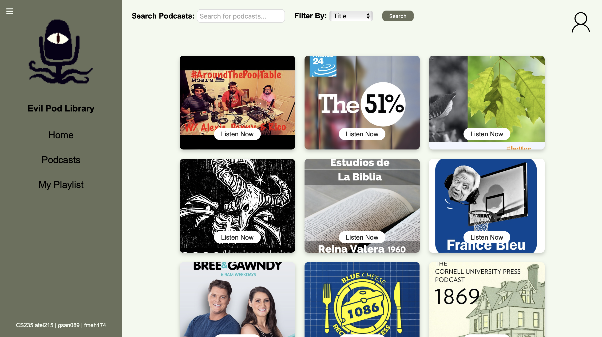
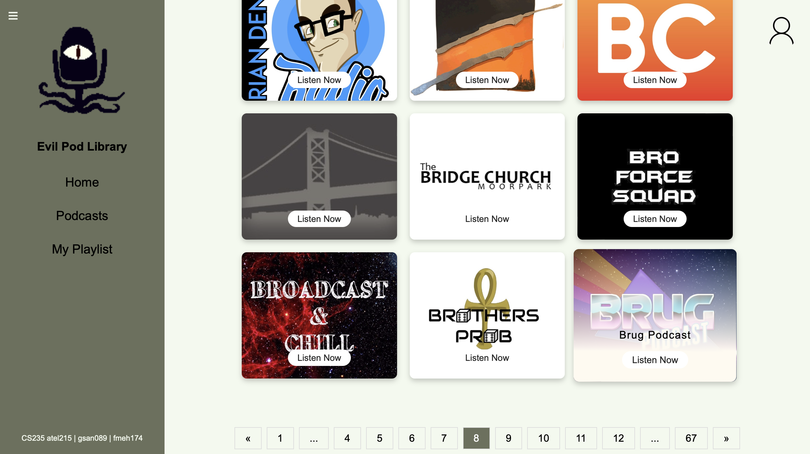

# 🎧 Podcast-Library-Webapp
*University project done in teams of 3, built using Python, Jinja2, SQLAlchemy, HTML/CSS and Flask, this webapp includes pagination, search, and detailed podcast views.*

[](https://www.python.org/downloads/)
[](https://flask.palletsprojects.com/)
[](https://www.sqlalchemy.org/)
[](tests/)

A sophisticated web-based digital podcast library platform,this full-stack application features advanced search functionality, user authentication, playlist management, and both in-memory and database storage options with a clean, modern interface.

## 🚀 Demo

### Homepage & Browse Interface







## ✨ Key Features Implemented

### 🔍 **Advanced Search & Discovery**
- **Multi-parameter search**: Search by podcast title, author name, or category
- **Intelligent filtering**: Dropdown-based filter selection with case-insensitive matching
- **Paginated results**: Optimized pagination (15 podcasts per page) for performance
- **Browse functionality**: Alphabetically sorted podcast catalog

### 👤 **Secure User Authentication**
- **Registration system**: Password validation with complexity requirements (8+ chars, uppercase, lowercase, digits)
- **Session management**: Flask-WTF with CSRF protection and secure signed cookies
- **Access control**: `@login_required` decorator protecting authenticated routes
- **Flash messaging**: User feedback for login/logout/registration actions

### 🎵 **Interactive Podcast Experience**
- **Detailed podcast pages**: Full metadata display with author, categories, language, website
- **Integrated audio player**: HTML5 audio controls for direct episode streaming
- **Episode reviews**: Authenticated users can rate (1-5) and review individual episodes
- **Pagination**: Episode lists paginated for optimal loading performance

### 📱 **Personal Playlist Management**
- **Add episodes**: Individual episode addition to personal playlists
- **Add full podcasts**: Bulk addition of all episodes from a podcast
- **Remove functionality**: Individual episode removal from playlists
- **Visual organization**: Episodes grouped by podcast in playlist view

### 🏗 **Dual Storage Architecture**
- **Memory repository**: Fast in-memory storage for development/testing
- **SQLAlchemy database**: Persistent SQLite database with ORM mapping
- **Seamless switching**: Configuration-based repository selection
- **Data integrity**: Proper foreign key relationships and constraints

## 🛠 Technical Architecture

### **Backend Stack**
- **Python 3.9+** - Core application logic with type hints
- **Flask 2.0+** - Web framework with Blueprint modularization
- **SQLAlchemy** - ORM with declarative mapping and session management
- **Flask-WTF** - Form validation and CSRF protection
- **Werkzeug** - Password hashing and security utilities
- **Password-validator** - Complex password validation rules

### **Frontend Technologies**
- **HTML5 & CSS3** - Modern semantic markup with responsive design
- **Jinja2 Templates** - Template inheritance and component reusability
- **Audio API** - HTML5 audio controls for podcast streaming
- **Form Validation** - Client and server-side validation

### **Architecture Patterns**
- **Repository Pattern** - Abstract data access with interchangeable implementations
- **Blueprint Architecture** - Modular route organization by feature
- **Service Layer** - Business logic separation from presentation
- **ORM Mapping** - Declarative database schema with relationships

## 🚀 Quick Start

### Prerequisites
- Python 3.9+
- pip package manager
- Git

### Installation & Setup

1. **Clone the repository**
   ```bash
   git clone https://github.com/fmeh174/Podcast-Library-Webapp.git
   cd Podcast-Library-Webapp
   ```

2. **Create and activate virtual environment**
   ```bash
   # Windows
   python -m venv venv
   venv\Scripts\activate

   # macOS/Linux
   python3 -m venv venv
   source venv/bin/activate
   ```

3. **Install dependencies**
   ```bash
   pip install -r requirements.txt
   ```

4. **Configure environment**
   ```bash
   # Set Flask app
   set FLASK_APP=wsgi.py  # Windows
   export FLASK_APP=wsgi.py  # macOS/Linux
   
   # Set repository type (memory or database)
   set REPOSITORY=memory  # Windows
   export REPOSITORY=memory  # macOS/Linux
   ```

5. **Run the application**
   ```bash
   flask run
   ```

6. **Access the application**
   Open `http://localhost:5000` in your browser

## 🧪 Testing

### Run Test Suite
```bash
# Run all tests with verbose output
python -m pytest -v tests/

# Run with coverage report
python -m pytest --cov=podcast tests/

# Run specific test modules
python -m pytest tests/unit/          # Unit tests
python -m pytest tests/integration/   # Integration tests
python -m pytest tests/e2e/          # End-to-end tests
```

### Test Categories
- **Unit Tests**: Domain model validation, service layer logic
- **Integration Tests**: Repository operations, database interactions
- **End-to-End Tests**: Complete user workflows, authentication flows

## 🔐 Security Implementation

- **Password Security**: Werkzeug password hashing with salt
- **CSRF Protection**: Flask-WTF token validation on forms
- **Session Management**: Secure signed cookies with Flask sessions
- **Input Validation**: WTForms validation with custom validators
- **SQL Injection Prevention**: SQLAlchemy ORM parameterized queries

## 🎯 Key Routes & Functionality

| Route | Method | Description | Auth Required |
|-------|--------|-------------|---------------|
| `/` | GET | Homepage | No |
| `/podcasts` | GET | Browse all podcasts (paginated) | No |
| `/podcasts/<id>` | GET | Podcast details with episodes | No |
| `/search` | GET | Search podcasts by title/author/category | No |
| `/authentication/register` | GET/POST | User registration | No |
| `/authentication/login` | GET/POST | User login | No |
| `/authentication/logout` | GET | User logout | No |
| `/podcasts/<podcast_id>/episode/<episode_id>` | GET | Episode details with reviews | Yes |
| `/review` | GET/POST | Add episode review | Yes |
| `/add_episode` | GET/POST | Add episode to playlist | Yes |
| `/add_podcast` | GET/POST | Add all podcast episodes to playlist | Yes |
| `/view` | GET | View user playlists | Yes |
| `/remove_episode` | GET/POST | Remove episode from playlist | Yes |

## 📈 Performance Features

- **Efficient Pagination**: Database-level pagination with LIMIT/OFFSET
- **Caching Strategy**: Service layer caching of podcast dictionaries
- **Optimized Queries**: SQLAlchemy relationship loading strategies
- **Memory Management**: Proper session lifecycle management
- **Static Assets**: Optimized CSS and image delivery

## 🎨 UI/UX Features

- **Responsive Design**: Mobile-friendly layout with flexbox/CSS Grid
- **Card-Based Layout**: Modern podcast browsing interface
- **Audio Integration**: HTML5 audio controls for episode playback
- **Visual Feedback**: Flash messages for user actions
- **Intuitive Navigation**: Sidebar navigation with session state
- **Search Interface**: Real-time search with filter options

## 🚢 Configuration Options

### Repository Configuration
```python
# In config.py
REPOSITORY = 'memory'    # or 'database'
SQLALCHEMY_DATABASE_URI = 'sqlite:///podcast.db'
SQLALCHEMY_ECHO = False  # Set to True for SQL debugging
```

### Security Configuration
```python
SECRET_KEY = 'your-secret-key'
WTF_CSRF_ENABLED = True
WTF_CSRF_TIME_LIMIT = None
```

## 🎓 Technical Achievements

This project demonstrates expertise in:

- **Full-Stack Web Development**: Complete Flask application with frontend/backend
- **Database Design**: Proper normalization with SQLAlchemy ORM relationships
- **Software Architecture**: Repository pattern, service layer, blueprint organization
- **Security Implementation**: Authentication, CSRF protection, password hashing
- **Data Management**: CSV import, dual storage systems, data validation
- **User Experience**: Responsive design, pagination, search functionality
- **Testing**: Comprehensive test coverage with multiple test types
- **Code Quality**: Type hints, documentation, clean architecture

## 🛣 Future Enhancements

- [ ] **API Development** - RESTful API endpoints for mobile app integration
- [ ] **Advanced Search** - Full-text search with Elasticsearch
- [ ] **Recommendation Engine** - ML-powered podcast suggestions
- [ ] **Social Features** - User following, shared playlists, comments
- [ ] **Analytics Dashboard** - User engagement metrics and statistics
- [ ] **Mobile App** - React Native companion application
- [ ] **Real-time Features** - WebSocket notifications for new episodes
- [ ] **Cloud Storage** - Integration with AWS S3 for audio files

---

*Built with ❤️ and lots of ☕*

## 🎧 Getting Started as a User

1. **Browse Podcasts**: Visit the homepage and explore the podcast catalog
2. **Search**: Use the search functionality to find podcasts by title, author, or category
3. **Listen**: Click on any podcast to view episodes and use the built-in audio player
4. **Create Account**: Register to unlock playlist management and review features
5. **Build Playlists**: Add individual episodes or entire podcasts to your personal playlist
6. **Review & Rate**: Share your thoughts on episodes with ratings and detailed reviews

---
**Thank you for reading! 😊💝**
